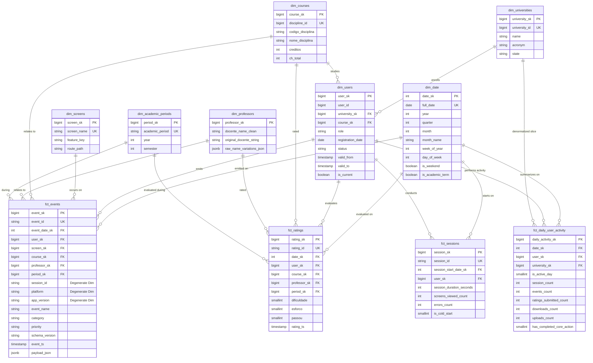

# Analytical Star Schema ERD

This document presents the visual **Entity-Relationship Diagram (ERD)** for the **GradMent Data Platform** analytical data warehouse, designed according to Kimball star schema methodology.

> [!IMPORTANT]
> **Degenerate Dimension Note**: `fct_events` records `session_id` as a degenerate attribute (plain UUID string) without a foreign key constraint to `fct_sessions`. `fct_sessions` is populated downstream by grouping `fct_events` by `session_id`.

## Dimensional Structure Summary

- **Atomic Fact**: `fct_events` (1 row per event tracked).
- **Domain Facts**: `fct_ratings` (academic ratings), `fct_sessions` (derived user sessions).
- **Rollup Fact**: `fct_daily_user_activity` (daily user engagement & retention).
- **Dimensions**: `dim_users` (SCD2), `dim_professors`, `dim_courses`, `dim_universities`, `dim_academic_periods`, `dim_date`, `dim_screens`.
