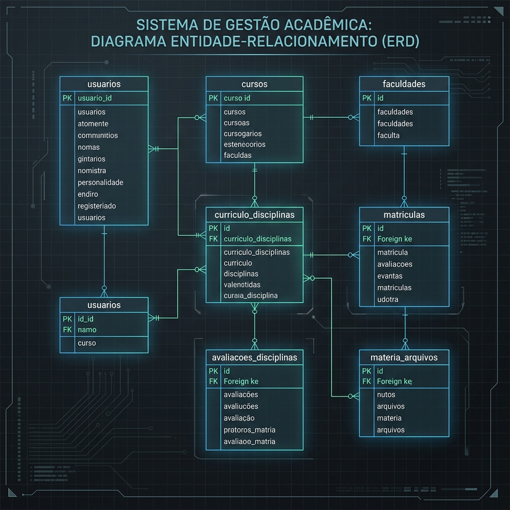

# Entity-Relationship Diagram (ERD) & Schema Analysis

**System:** GradMent Data Platform — Operational Database Inventory  
**Target Warehousing Layer:** Staging Schema (`raw`) → Star Schema (`marts`)  

---

## 🖼️ Visual ERD Diagram

---

## 1. Core Entity Domains & Relationships

### 1.1 Identity & User Access
- **`usuarios`**: Core user table (students, coordinators, admins).
- **`papeis` & `usuarios_papeis`**: Role-based access control (1:N relationship via junction table).
- **`usuario_academicos`**: Connects `usuarios` to their academic institution (`faculdades`) and enrolled course (`cursos`).

### 1.2 Academic Curriculum & Structure
- **`faculdades`**: Universities/institutions registered in the system (e.g. CEFET-MG).
- **`cursos`**: Undergraduate degree programs associated with a `faculdade`.
- **`curriculos`**: Specific curriculum grid versions for a course (ano de vigor, total de créditos).
- **`curriculo_disciplinas`**: Specific academic subjects within a curriculum grid (código, período sugerido, carga horária, eixo).
- **`curriculo_dependencias`**: Prerequisites and corequisites between disciplines (self-referential hierarchy on `curriculo_disciplinas`).

### 1.3 Enrollment, Performance & Activity
- **`materias_matriculadas`**: Current active course enrollments per student per semester.
- **`aluno_disciplina_historico`**: Historical transcript of completed, failed, or equivalent courses (`situacao`, `nota`, `frequencia`).
- **`avaliacoes_disciplinas`**: Student ratings and feedback submitted for disciplines (`nota_dificuldade`, `nota_didatica`, `recomendacao`, `comentario`).
- **`materia_arquivos` & `materia_arquivos_votos`**: Crowdsourced study materials and past exams uploaded by students, along with upvotes/downvotes.

---

## 2. Key Foreign Key Mappings

| Parent Entity | Child Entity | Foreign Key Column | Cardinality | Enforced at DB Level |
|---|---|---|---|---|
| `usuarios` | `usuario_academicos` | `usuario_id` | 1:N | Yes |
| `faculdades` | `cursos` | `faculdade_id` | 1:N | Yes |
| `cursos` | `curriculos` | `curso_id` | 1:N | Yes |
| `curriculos` | `curriculo_disciplinas` | `curriculo_id` | 1:N | Yes |
| `usuarios` | `materias_matriculadas` | `usuario_id` | 1:N | Yes |
| `curriculo_disciplinas` | `materias_matriculadas` | `disciplina_id` | 1:N | Inferred / Application Level |
| `usuarios` | `avaliacoes_disciplinas` | `usuario_id` | 1:N | Yes |
| `curriculo_disciplinas` | `avaliacoes_disciplinas` | `disciplina_id` | 1:N | Yes |
| `usuarios` | `materia_arquivos` | `usuario_id` | 1:N | Yes |

---

## 3. Analytical Gaps & Additive Event Requirements

The operational MySQL database is structured strictly for OLTP transaction processing. To support the Product Analytics platform (Phase 1+), the following primitives are missing and must be added in Phase 2:

1. **`analytics_events` Table**: An additive, append-only event stream table to capture behavioral events (`user_registered`, `login_succeeded`, `discipline_rated`, `material_downloaded`, `planning_session_completed`).
2. **Session Boundary Detection**: Standardizing `session_id` UUID tracking to group atomic events into analytical user sessions (`fct_sessions`).
3. **Anonymization Layer**: Salting and hashing `usuario_id` into `user_key` during extraction before landed into PostgreSQL staging.
