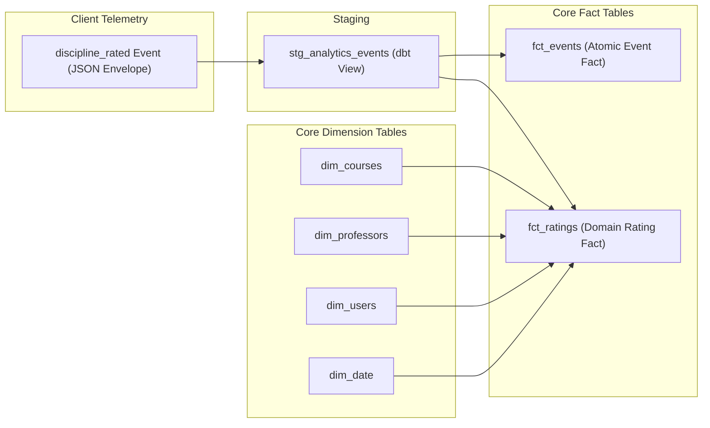
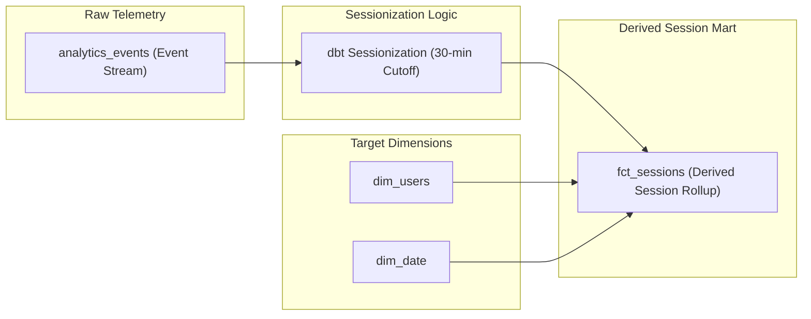
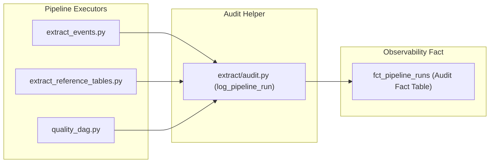

# Data Lineage Specification — GradMent Data Platform

This document describes the end-to-end data lineage across the GradMent Data Platform, detailing source extraction, staging transformations, core mart population, and observability fact logging.

---

## 1. End-to-End Data Lineage Overview

```mermaid
graph TD
    subgraph Operational & Telemetry Sources
        S1["Client App Telemetry (web/mobile)"]
        S2["MySQL Operational DB (usuarios, disciplinas)"]
        S3["Pipeline Execution Context"]
    end

    subgraph Extract & Watermark Layer
        E1["extract_events.py (Incremental Watermark)"]
        E2["extract_reference_tables.py"]
        E3["extract/audit.py"]
    end

    subgraph Staging Layer (PostgreSQL)
        ST1["analytics_events (Staging Table)"]
        ST2["stg_analytics_events (dbt View)"]
        ST3["stg_operational_tables (dbt View)"]
    end

    subgraph Core Marts (Kimball Star Schema)
        F1["fct_events (Incremental Fact)"]
        F2["fct_daily_user_activity (Rollup Fact)"]
        F3["fct_ratings (Domain Fact)"]
        F4["fct_sessions (Derived Session Fact)"]
        D1["dim_users (SCD2)"]
        D2["dim_courses"]
        D3["dim_professors"]
        D4["dim_universities"]
        D5["dim_academic_periods"]
        D6["dim_date"]
        D7["dim_screens"]
        F5["fct_pipeline_runs (Observability Fact)"]
    end

    S1 --> E1 --> ST1 --> ST2
    S2 --> E2 --> ST3
    S3 --> E3 --> F5

    ST2 --> F1
    ST2 --> F2
    ST2 --> F3
    ST2 --> F4

    ST3 --> D1
    ST3 --> D2

    D1 --> F1
    D1 --> F2
    D1 --> F3
    D1 --> F4

    D2 --> F1
    D2 --> F3

    D3 --> F1
    D3 --> F3

    D4 --> F2

    D5 --> F1
    D5 --> F3

    D6 --> F1
    D6 --> F2
    D6 --> F3
    D6 --> F4

    D7 --> F1
```

---

## 2. Specific Lineage Chains

### Chain 1: Critical Telemetry Event Lineage (`discipline_rated`)
Tracks the flow of an evaluation event from client telemetry to academic rating analytics.



- **Source**: `discipline_rated` event payload emitted by frontend UI.
- **Staging**: Parsed and validated in `stg_analytics_events`.
- **Marts**: Populates atomic `fct_events` and specialized `fct_ratings` table, joining `dim_courses`, `dim_professors`, `dim_users`, and `dim_date`.

---

### Chain 2: Derived Fact Lineage (`fct_sessions`)
Tracks the derivation of user session rollups from raw event activity.



- **Source**: Raw event stream in `analytics_events`.
- **Transformation**: Grouped by `session_id` with 30-minute inactivity threshold calculation (`session_duration_seconds`, `screens_viewed_count`, `errors_count`).
- **Mart**: Loaded into `fct_sessions`.

---

### Chain 3: Pipeline Observability Lineage (`fct_pipeline_runs`)
Tracks execution metadata for pipeline runs and data quality gates.



- **Source**: Python extractors and Airflow DAG task context.
- **Transformation**: Captures UTC `start_time`, UTC `end_time`, calculates `duration_seconds = (end_time - start_time)`, records `rows_extracted`, `rows_loaded`, and status (`SUCCESS` / `FAILED`).
- **Mart**: Persisted in `fct_pipeline_runs`.
